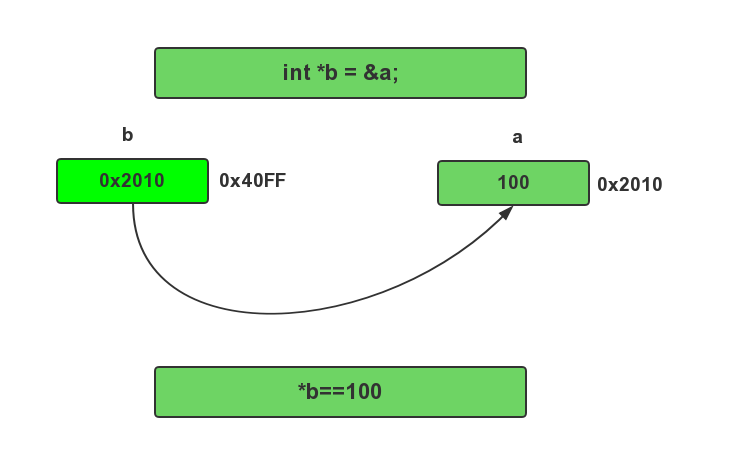

# 指针🧭

## 指针定义

**指针**是一个变量，其值为另一个变量的地址，即，内存位置的直接地址。就像其他变量或常量一样，您必须在使用指针存储其他变量地址之前，对其进行声明。指针变量声明的一般形式为：

```
类型标识符 *变量名
```

例:

```c
int    *ip;    /* 一个整型的指针 */
double *dp;    /* 一个 double 型的指针 */
float  *fp;    /* 一个浮点型的指针 */
char   *ch     /* 一个字符型的指针 */
```

所有指针的值的实际数据类型，不管是整型、浮点型、字符型，还是其他的数据类型，都是一样的，都是一个代表内存地址的长的十六进制数。不同数据类型的指针之间唯一的不同是，指针所指向的变量或常量的数据类型不同。


## 理解指针


要理解C指针，我认为一定要理解C中"变量"的存储实质， 所以我就从"变量"这个东西开始讲起吧！

内存只不过是一个存放数据的空间，就好像我 的看电影时的电影院中的座位一样。每个座位都要编号，我们的内存要存放各种各样的数据，当然我们 要知道我们的这些数据存放在什么位置吧！所以内存也要象座位一样进行编号了，这就是我们所说的内 存编址。座位可以是按一个座位一个号码的从一号开始编号，内存则是按一个字节一个字节进行编址， 如上图所示。每个字节都有个编号，我们称之为内存地址。


## 指针的应用

### &取地址符

如果我们已经有了一个变量`a`,想获得`a`的地址,我们要用到`&`取地址符,它的用法如下:

```
& 变量名;//这是返回变量名的地址编号
```


例:
```c
int a=10;
printf("%d\n",a);
printf("%d\n",&a);//10进制输出
printf("%x\n",&a);//16进制输出
```


### *解地址符/解引用

如果我们已经有一个地址变量`b`,那我们如何得到`b`所指向变量里的值?如何修改`b`所指向变量的值?

我们使用解引用符号:`*`,它的用法如下:

```
* 指针变量名;// 指针变量所指的地址的内容
```



```c
int a =100;
int *b=&a;
printf("%d\n",*b);//输出指针b所指地址的内容
int c,*pc;
c=10;
pc=&c;
*pc=20;
printf("%d\n",c);//c的值变成20
```

### 综合应用

```c
#include <cstdio>
int main ()
{
    int  var = 20;   // 实际变量的声明
    int  *ip;        // 指针变量的声明
    ip = &var;       // 在指针变量中存储 var 的地址
    printf("Value of var variable: ");
    printf("%d",var);
    // 输出在指针变量中存储的地址
    printf("Address stored in ip variable: ");
    printf("%d\n",ip);
    // 访问指针中地址的值
    printf("Value of *ip variable: ");
    printf("%d",*ip);
    return 0;
}
```
## 数组与指针

### 1.互通

看下面代码

```c
int i,a[]={3,4,5,6,7,3,7,4,4,6};
for (i=0;i<=9;i++)
{
printf ( "%d", a[i] );
}
```

很显然，它是显示a 数组的各元素值。

我们还可以这样访问元素，如下

```c
int i,a[]={3,4,5,6,7,3,7,4,4,6};
for (i=0;i<=9;i++)
{
printf ( "%d",　 *(a+i) );
}
```

它的结果和作用完全一样

### 2.通过指针访问数组元素

```c
int i,*pa,a[]={3,4,5,6,7,3,7,4,4,6};
pa =a　 ;//请注意数组名a直接赋值给指针 pa
for (i=0;i<=9;i++)
{
printf ( "%d", pa[i] );
} 
```

很显然，它也是显示a 数组的各元素值。


另外与数组名一样也可如下：

```c
int i,*pa,a[]={3,4,5,6,7,3,7,4,4,6};
pa =a;
for (i=0;i<=9;i++)
{
printf ( "%d", *(pa+i) );
}
```

看pa=a即数组名赋值给指针，以及通过数组名、指针对元素的访问形式看，它们并没有什么区别，从 这里可以看出数组名其实也就是指针。难道它们没有任何区别？有，请继续。

## 指针类型的含义

指针的本质是指向一个内存的地址,本质是是数字,那为什么还会有类型呢? 例如`int *,char *`

```c
#include <cstdio>

char str[] = "abcde";

int main(){

    char *p1 = &str[0];

    //int *p2 = (int *)&str[0];
    int *p2 = (int *)&str[0];

    printf("%llx\n",(long long )p1);
    printf("%llx\n",(long long )p2);


    printf("%c\n",*p1);
    printf("%d\n",*p2);

    //输出 p2 的低 8位
    printf("%c\n",*p2 & 0x000000ff);
    printf("%c\n",(*p2 & 0x0000ff00) >> 8);
    printf("%c\n",(*p2 & 0x00ff0000) >> 2*8);
    printf("%c\n",(*p2 & 0xff000000) >> 3*8);

    return 0;
}
```


类型表示,按不同的原则去解释这块内存里的值.

### 3.数组名与指针变量的区别

请看下面的代码：

```c
int i,*pa,a[]={3,4,5,6,7,3,7,4,4,6};
pa =a;
for (i=0;i<=9;i++)
{
printf ( "%d", *pa );
pa++ ;　 //注意这里，指针值被修改
}
```

可以看出，这段代码也是将数组各元素值输出。不过，你把{}中的pa改成a试试。你会发现程序编译 出错，不能成功。看来指针和数组名还是不同的。其实上面的指针是指针变量，而数组名只是一个指针 常量。这个代码与上面的代码不同的是，指针pa在整个循环中，其值是不断递增的，即指针值被修改了 。数组名是指针常量，其值是不能修改的，因此不能类似这样操作：a++.前面4，5节中pa[i]，*（pa+i ）处，指针pa的值是使终没有改变。所以变量指针pa与数组名a可以互换。


## 传递指针给函数

请看函数那一节

## 引用说明

 - [彻底搞定 C/C++ 指针](http://www.cnblogs.com/qiaogaojian/p/5861554.html)
 - [C++指针](http://www.runoob.com/cplusplus/cpp-pointers.html)
