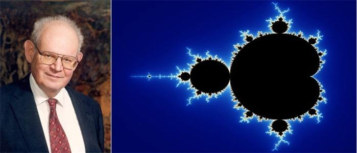

# 递归

1. 表现形式: 函数的自我调用
2. 怎么理解: 

## 核心: 模型


1. 磊方块
2. 树模型

递归的本质是分解子问题
当你把子问题看成一个"点"(状态),的时候,那么递归就是在树的上的行走

1.递归的本质是分解子问题
1.递归是在树上行走


## 递归的概念

同学们看下面这幅图片：


我们发现如下的特点:照片中的图像就是本身,同时照片中的照片也是本身.

象这样，一个对象部分地由它自己组成，或者是按它自己定义，我们称之为**递归**。

## 函数的递归调用

我们已经学习过有关函数的知识了,我们知道一个函数可以被其它函数调用.但是你有没有想过:**如果一个函数调用自己本身会发生什么?**


一个函数、概念或数学结构，如果在其定义或说明内部又直接或间接地出现有其本身的引用，则称它们是递归的或者是递归定义的。在程序设计中，过程或函数直接或者间接调用自己，就被称为递归调用。

## 递归的重要概念

递归是借助于一个**栈**来实现；**递归=前进+回溯**:

 - **递推**：问题不停的向一极(问题的深度)推进,这一过程叫做**前进**；这一过程相当于压栈.
 - **回溯**：问题逐一解决，最后回到原问题，这一过程叫做**回溯**。这一过程相当于弹栈。


## 递归的一般写法

```c
int func(int a){
    if(a xxx){ //边界条件
        return  ;
    }

    //递归方程,具体的操作
    a ==xx;
    return xx;
}
```


## 拓展知识




曼德勃罗特集是人类有史以来做出的最奇异,最瑰丽的几何图形.曾被称为“上帝的指纹”。 这个点集均出自公式:Zn+1=(Zn)^2+C,


如果你仔细观察自然的事物,你会发现:自然界的大部分结构都是越微小越复杂,你越接近的观察,就能揭示越多的细节(无限长度海岸线,雪花的边长无限,面积有限).大部分的自然界的微观结构会近乎一致地符合**分形**的特征.

[走近混沌-大自然中的分形](http://blog.sciencenet.cn/blog-677221-604623.html)

分形就是自然界的递归,因为它局部和整体相似.

书[蝴蝶效应之迷-走近分形与混沌](http://book.douban.com/subject/24844888)

链接: https://pan.baidu.com/s/1nvp7oBf 密码: thp6

## 相关资料

 - [视频-曼德勃罗集](http://v.ku6.com/show/Y8otAn99bv9m_WYltsUmKQ...html)
 - [曼德勃罗集-百度百科](http://baike.baidu.com/item/%E6%9B%BC%E5%BE%B7%E5%8B%83%E7%BD%97%E9%9B%86)
 - [谢尔宾斯基三角形-百度百科](http://baike.baidu.com/item/%E8%B0%A2%E5%B0%94%E5%AE%BE%E6%96%AF%E5%9F%BA%E4%B8%89%E8%A7%92%E5%BD%A2/1332191)
 - [分形几何学-百度百科](http://baike.baidu.com/item/%E5%88%86%E5%BD%A2%E5%87%A0%E4%BD%95%E5%AD%A6/1296976)
