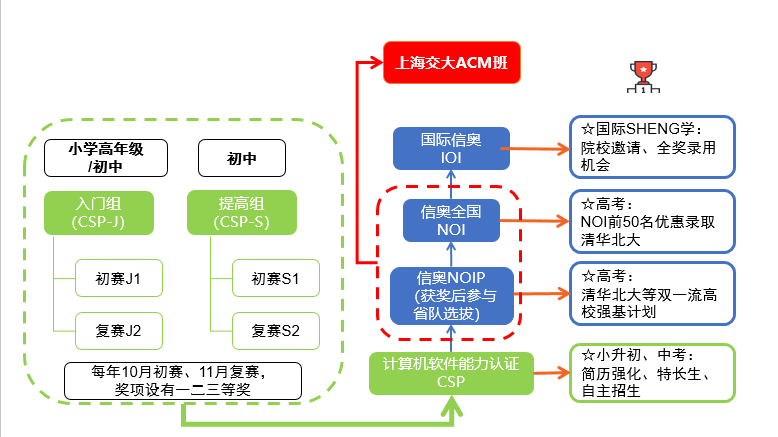

# 竞赛学习路线与我的思考

含义说明:

- Q: question 问题
- A: ansert 回答

## 竞赛大概需要的知识

算法学习知识点

## 竞赛的各个阶段

## 阶段的大概描述

| 学习阶段 | 做过的题目数量 | 描述                       | 花费的时间                              |
|----------|----------------|----------------------------|-----------------------------------------|
| 入门     | 100-200        | 小学生难度                 | 学的快1个月，慢3-6个月                  |
| 普及     | 300-500        | 小学，初中难度             | 快6个月，慢2年                          |
| 提高     | 500-1000       | 超过普通大学计算机学习内容 | 快1年，慢3年                            |
| 省选     | 2000以上       | 难                         | 能到这个地步，很少,需要极大的天分与毅力 |
| 全国赛   | 3000以上       | 难                         | 不知道(PS. 金银牌会被保送清华)          |

## 各个阶段,学生与教练的各自任务

| 学习阶段 | 教练                                          | 学生                                                                          |
|----------|-----------------------------------------------|-------------------------------------------------------------------------------|
| 入门     | 手把手教,作用:90%                             | 亦步亦趋的学                                                                  |
| 普及     | 手把手教,作用:70%                             | 亦步亦趋的学,但是要自我思考及把思考的内容与结果写到笔记上                     |
| 提高     | 教(但不是全部),提供学习相关资源[注1],作用:50% | 独立的思考,要能提出疑问,自己解决问题(一切的方法),同时掌握一定的其它计算机技能 |
| 省选     | 作用:20%                                      | 完全的独立(可以进行自我的学习与更新),甚至可以反过来对教练进行教学             |
| 全国赛   | 0%                                            | 不知道                                                                        |

注1,学习的相资源指

- 学习的文本,视频等实际的信息型资料
- 举办比赛(与其他现等选手)
- 联系金牌选手进行教学
- 参加其它地方的培训
- 等等其它教育资源

## Q:有什么有效的学习路径

A:

其实OI没有什么极其有效的学习路径，只能靠持之以恒的学习和刷题。

信息学竞赛其实是一个与其他奥赛有很大不同的比赛，需要更多的知识和努力。而且这也不是一两个月能够精通的，是一个长年累月不断积累和锻炼的结晶！

在家里努力刷题（一般每天1~2道，假期里甚至一天10道）

## Q:是不是需要天分

A:

越往后面的阶段越需要.

但是开始入门的阶段,如果没有兴趣与自控,连入门也不行.

与所有的学习一样,自控是最重要的,是贯穿始终的. 但是兴趣可以减少一部分的自控能力的需求.

但当你越过了初始阶段后(入门+普及,也可以说提高这个阶段也算),那你就符合这个规律:

> 天才是1%的灵感加上99%的汗水下一句是:但**那一份灵感(天分)往往是最重要的,甚至比那百分之九十九的汗水都要**重要。

ps: 为什么说提高也算初始阶段呢,因为一个普通高中生如果自控能力非常强,他可以通过大量写题(哪怕他不喜欢)的方式,拿到一等奖.

## Q:还有其它的要注意吗

功夫在诗外.

在学习计算机信息竞赛的过程,不仅仅是写代码的过程,你还需要掌握一些其它的技能:

1. 英语的读写能力,因为你需要(后期)在国外的网站上做题与比赛
2. 数学,因为有很多的数学题目
    - 小学数学奥数(基本能力)
    - 数论(高中数学课不会学习这个知识,但是提高组需要)
    - 计算几何,概率论,离散数学(后期)
3. linux操作系统的掌握,因为你要在linux系统写题目,所以你需要linux上的工具链的使用(书:鸟哥的linux私房菜)
4. github,git (程序员必会)
5. 其它

## 概括总结

OI这种东西只有靠不断的积累学习、不懈刷题，才能有显著的提高，并没有什么捷径所在。因此不能急于求成。如果您觉得自己真的来不及了，那么请使用更多的时间，使用更多的经历，全身心地投入到OI的学习中。你可以在这个过程中寻求乐趣，循序渐进，以求提高！

